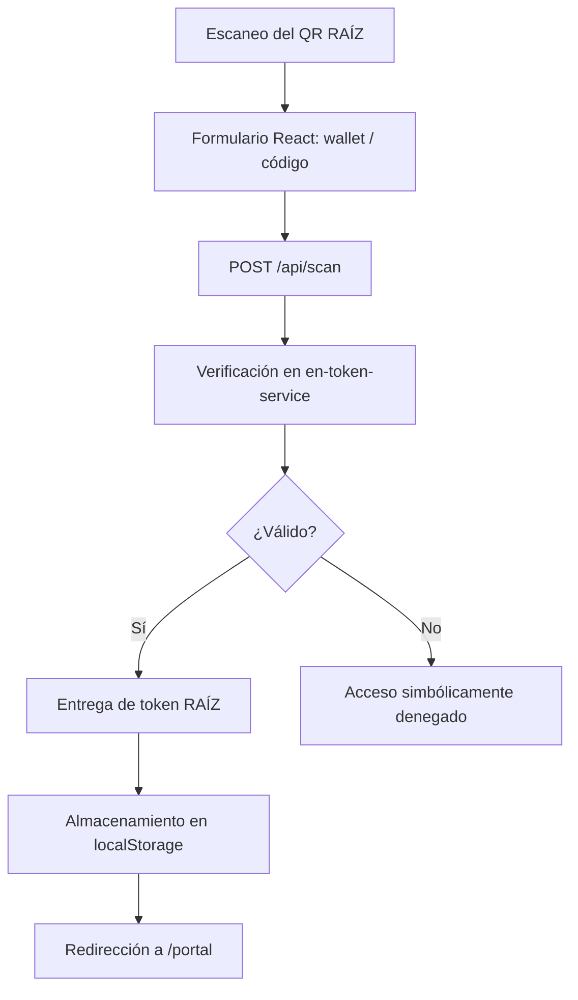
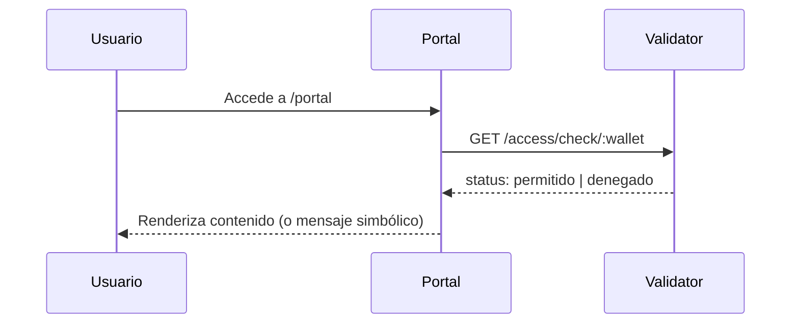

# 🔁 Flujos RAÍZ

**"Del reciclaje físico al acceso espiritual."**

Este archivo documenta los flujos clave dentro del portal `en-landing-astro`, conectando capas físicas, digitales y simbólicas del ecosistema Enraiza.

---

## 🌀 Flujo principal: Escaneo → Token → Portal

---

## 🔐 Validación de Acceso

---

## 🌿 Microservicios involucrados

| Servicio              | Rol simbólico                                     |
|-----------------------|---------------------------------------------------|
| `en-token-service`    | El árbol que entrega un fruto (token RAÍZ)        |
| `en-access-validator` | El guardián que evalúa el mérito para cruzar      |
| `en-landing-astro`    | El portal de entrada y espejo de transformación   |

---

## 🧩 Estado simbólico (por sección)

| Sección         | Requiere Token RAÍZ | Validación Backend |
|------------------|---------------------|---------------------|
| `/` (landing)    | ❌                  | ❌                  |
| `/portal`        | ✅                  | ✅                  |
| `/scan` (API)    | ✅                  | ✅                  |

---

## ✨ Notas

- Los tokens RAÍZ no se otorgan sin acto simbólico.
- Cada paso está representado visualmente en el portal.
- Puede integrarse animación o feedback para cada etapa.

---

**"Cuando reciclas materia, siembras espíritu."**

🌱 Fundación Enraiza
